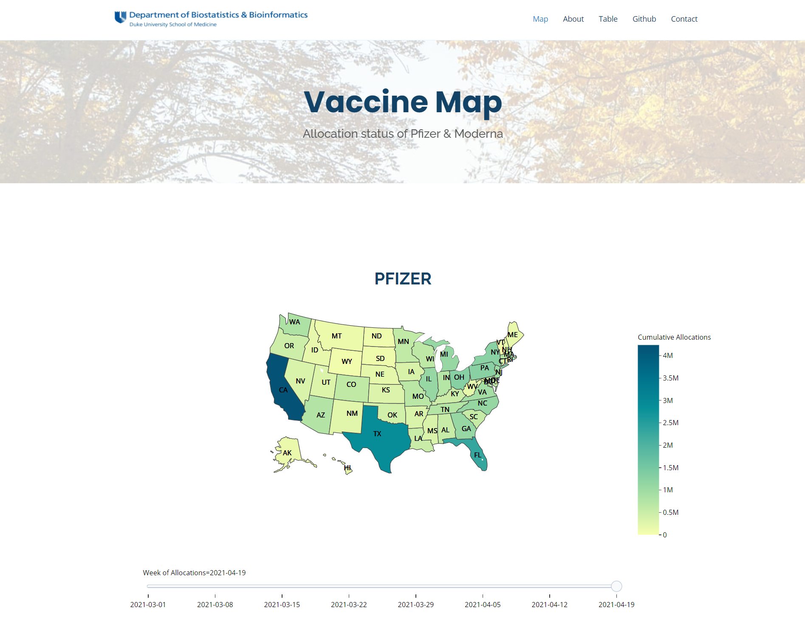

# **US Covid-19 Vaccination Visualization Project**  
The US Covid-19 Vaccinations is a simple web application presenting the recent progress of COVID-19 vaccinations in United States for each state based on data from CDC. This project has been served at Heroku, online access link [here](https://rocky-chamber-42445.herokuapp.com/).

## Snapshot


## **Features Intended to Implement**  
1. Interactive US Map: Create an interative US map visualizing the current total doses allocation by state/territory.
2. Time slider: Plot the comparison of vaccine allocations between Pfizer and Moderna with a slider showing the allocaion history.
3. Race plot: Provide an animation for top 10 most allocated states over time.
4. Stats Table: Present the statistic of finished vaccine allocation in each state; Create a drop-down list and a search box for user's choices of interest for states.

## Directory Tree
```
├──run.py
├──main
    └──static
        ├──img
        ├──assets
            ├──css
            ├──img
            ├──js
            ├──vendor
    ├──templates
        ├──base.html
        ├──index.html
        ├──table.html
        ├──table2.html
        ├──figure
            ├──moderna.html
            ├──pfizer.html
            ├──race_plot.html
    ├──generator
        ├──map
        ├──db
    ├──__init__.py
    ├──route.py
    ├──vaccine.db
```

## Serve locally
Enter the root directory. Command `export FLASK_APP=main` in linux environment and run `flask run`

## **Data Source**  
All data are obtained from [Data.CDC.gov](https://data.cdc.gov/browse?category=Vaccinations)

## **Member and Contribution**  
* Web building, Server setting: Junrong Lin [@Ocss884](https://github.com/Ocss884)
* Data analysis, Visualization: Lucy Lin [@lucylin1997](https://github.com/lucylin1997), Wenyue Zhuo [@jennyzz17](https://github.com/jennyzz17)

## Architecture  
This application uses [Flask](https://flask.palletsprojects.com/en/1.1.x/) framwork, SQLite database and deployed in [Heroku](www.heroku.com). [Ploty](https://plotly.com/) is used for visualization.
